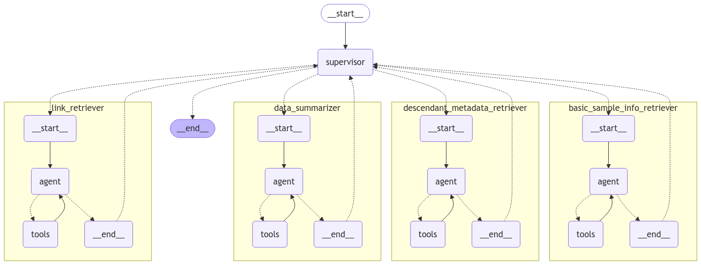

# Semantic LLM-aided Querying (SLAQChat)

This is a chatbot that uses an RDF-based semantic layer to transform user questions into database queries.

## Project Structure

- root directory
```
.
├── ENV.yml
├── ProjectDescription.docx
├── README.md
├── backend
├── db_data
├── docker-compose.yml
├── init-db
├── src
```

- src directory
```
.
└── chatbot
    ├── app.py
    ├── assets
    ├── basic_chat.ipynb
    └── bot.py
```

- backend directory
```
.
└── database
    ├── __init__.py
    ├── __pycache__
    │   ├── models.cpython-312.pyc
    │   └── populate_db.cpython-312.pyc
    ├── db_config.sh
    ├── getdbSchema.sh
    ├── impact_statistics.ipynb
    ├── mockdb_test.ipynb
    ├── models.py
    ├── old_partial_schema.sql
    └── populate_db.py
```
## Current Agent Architecture



## Contact

For any questions or feedback, please contact me (Taïsha Joseph) at taishajo@mit.edu.

## Resources

- [LangChain Academy](https://academy.langchain.com/) 
- [Multi-Agent System with LangGraph](https://blog.futuresmart.ai/multi-agent-system-with-langgraph)