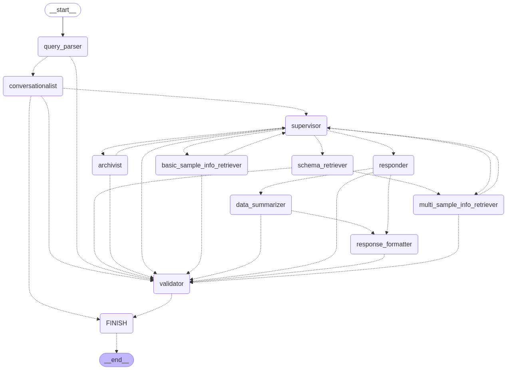

# **Semantic LLM-aided Querying (SLAQChat)**

This is multi-agent chatbot application that transforms user questions into database queries.

This is an extension feature of NExtSEEK, a platform for active data management. For more information, please visit the [NExtSEEK website](https://nextseek.mit.edu/).

You can find the source code for NExtSEEK [here](https://github.com/BMCBCC/NExtSEEK). 

## Agent Architecture (in progress)

This chatbot is built using LangGraph, a framework for building multi-agent systems and BAML to generate structured outputs from LLMs. Currently, the chatbot is designed to answer questions about the samples housed in the NExtSEEK database and also update metadata of existing samples.  

It is comprised of 1 central agent that interfaces with the user and multiple worker agents operating in tandem to answer user questions.

This chatbot is designed to be modular and extensible to support increasingly more complex queries and more sophisticated agents.

**This architecture is depicted in the following mermaid graph:**



## Instructions

### 1. Clone the repository

```bash
git clone https://github.com/tavjo/SLAQChat-new.git
```

### 2. Install docker and docker-compose on your computer

Installing Docker and Docker Compose allows you to manage containerized applications efficiently. Here's how you can set them up on different operating systems:

#### **For Ubuntu:**

1. **Uninstall Old Versions:**
```bash
sudo apt-get remove docker docker-engine docker.io containerd runc
```
This command removes any previous installations to avoid conflicts.

2. **Update Package Index and Install Dependencies:**
```bash
sudo apt-get update
sudo apt-get install -y ca-certificates curl gnupg lsb-release
```
This ensures your system is up-to-date and installs necessary packages.

3. **Add Docker’s Official GPG Key:**
```bash
sudo mkdir -p /etc/apt/keyrings
curl -fsSL https://download.docker.com/linux/ubuntu/gpg | sudo gpg --dearmor -o /etc/apt/keyrings/docker.gpg
```
This step adds Docker's GPG key for package verification.

4. **Set Up the Docker Repository:**
```bash
echo "deb [arch=$(dpkg --print-architecture) signed-by=/etc/apt/keyrings/docker.gpg] https://download.docker.com/linux/ubuntu $(lsb_release -cs) stable" | sudo tee /etc/apt/sources.list.d/docker.list > /dev/null
```
This command adds the Docker repository to your system's package sources.

5. **Install Docker Engine and Docker Compose Plugin:**
```bash
sudo apt-get update
sudo apt-get install -y docker-ce docker-ce-cli containerd.io docker-compose-plugin
```
This installs Docker Engine and the Docker Compose plugin.

6. **Verify Installation:**
```bash
sudo docker run hello-world
```
Running this command confirms that Docker is installed correctly.

7. **Optional – Run Docker as a Non-Root User:**
```bash
sudo groupadd docker
sudo usermod -aG docker $USER
```
After executing these commands, log out and back in to apply the changes. This allows you to run Docker commands without `sudo`.

#### **For Windows:**

1. **Download Docker Desktop:**
Visit the [Docker Desktop for Windows](https://docs.docker.com/desktop/install/windows-install/) page and download the installer suitable for your system.

2. **Install Docker Desktop:**
Run the downloaded installer and follow the on-screen instructions. Ensure that the option to use the WSL 2 based engine is selected during installation.

3. **Enable WSL 2:**
Docker Desktop requires WSL 2 for optimal performance. If not already enabled, you can set it up by following the [official guide](https://docs.microsoft.com/en-us/windows/wsl/install).

4. **Verify Installation:**
Open PowerShell and run:
```powershell
docker --version
docker compose version
```
These commands should display the installed versions of Docker and Docker Compose.

#### **For macOS:**

1. **Download Docker Desktop:**
Navigate to the [Docker Desktop for Mac](https://docs.docker.com/desktop/install/mac-install/) page and download the appropriate version for your Mac (Intel or Apple Silicon).

2. **Install Docker Desktop:**
Open the downloaded `.dmg` file and drag the Docker icon to your Applications folder.

3. **Start Docker Desktop:**
Launch Docker from your Applications folder. Once running, you should see the Docker icon in your menu bar.

4. **Verify Installation:**
Open Terminal and execute:
```bash
docker --version
docker compose version
```

These commands will display the installed versions of Docker and Docker Compose.

Remember to check the official Docker documentation for the most up-to-date instructions and version compatibility.

### 3. Create a .env file in your project root directory
 - Use the .env.example file to create your own .env file with your database credentials, OpenAI API key, LangChain API key, etc.

### 4. Start the application 

```bash
docker-compose up --build
```

## Contact

For any questions or feedback, please contact me (Taïsha Joseph) at taishajo@mit.edu.

## Resources

- [LangChain Academy](https://academy.langchain.com/) 
- [Multi-Agent System with LangGraph](https://blog.futuresmart.ai/multi-agent-system-with-langgraph)
- [Boundary markup language (BAML)](https://docs.boundaryml.com/guide/introduction/what-is-baml) 