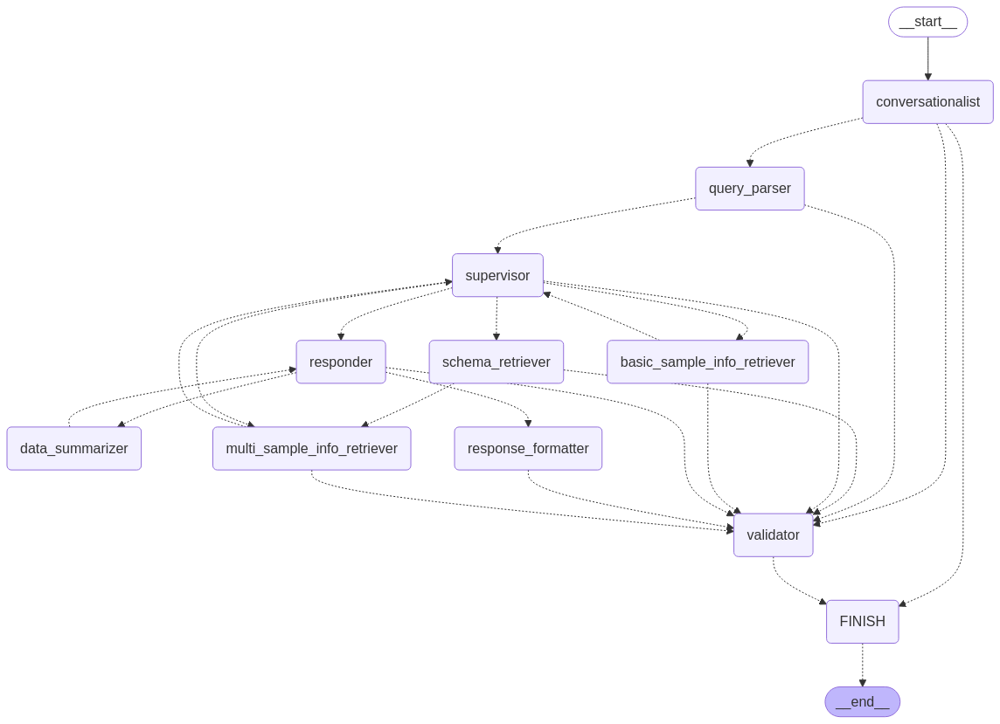

# **Semantic LLM-aided Querying (SLAQChat)**

This is multi-agent chatbot application that transforms user questions into database queries.

This is an extension feature of NExtSEEK, a platform for active data management. For more information, please visit the [NExtSEEK website](https://nextseek.mit.edu/).

You can find the source code for NExtSEEK [here](https://github.com/BMCBCC/NExtSEEK). 

## Agent Architecture (in progress)

This chatbot is built using LangGraph, a framework for building multi-agent systems. Currently, the chatbot is designed to answer questions about the samples housed in the NExtSEEK database.

It is comprised of 1 central agent that interfaces with the user and multiple worker agents operating in tandem to answer user questions.

This chatbot is designed to be modular and extensible to support increasingly more complex queries and more sophisticated agents.

**This architecture is depicted in the following mermaid graph:**



## Project Structure

- **root directory:**

```
.
├── ENV.yml
├── README.md
├── backend
├── docker-compose.yml
├── docs
├── img
├── robots.txt
├── src
```

- **src directory:**
```
src/
├── __init__.py
└── chatbot
    ├── __init__.py
    ├── app.py
    ├── assets
    ├── baml_client
    │   ├── __init__.py
    │   ├── async_client.py
    │   ├── globals.py
    │   ├── inlinedbaml.py
    │   ├── partial_types.py
    │   ├── sync_client.py
    │   ├── tracing.py
    │   ├── type_builder.py
    │   └── types.py
    ├── baml_src
    │   ├── clients.baml
    │   ├── conversationalist.baml
    │   ├── data_summarizer.baml
    │   ├── generators.baml
    │   ├── models.baml
    │   ├── navigator.baml
    │   ├── query_parser.baml
    │   ├── responder.baml
    │   ├── response_formatter.baml
    │   ├── schema_retriever.baml
    │   ├── supervisor.baml
    │   └── validator.baml
    ├── basic_chat.ipynb
    └── studio
        ├── __init__.py
        ├── advanced_sample_retriever.py
        ├── basic_sample_info.py
        ├── conversationalist.py
        ├── data_summarizer.py
        ├── helpers.py
        ├── langgraph.json
        ├── models.py
        ├── prompts.py
        ├── query_parser.py
        ├── requirements.txt
        ├── responder.py
        ├── response_formatter.py
        ├── sample_retriever.py
        ├── schema_retriever.py
        ├── supervisor.py
        └── validator.py
```

## Contact

For any questions or feedback, please contact me (Taïsha Joseph) at taishajo@mit.edu.

## Resources

- [LangChain Academy](https://academy.langchain.com/) 
- [Multi-Agent System with LangGraph](https://blog.futuresmart.ai/multi-agent-system-with-langgraph)
- [Boundary markup language (BAML)](https://docs.boundaryml.com/guide/introduction/what-is-baml) 