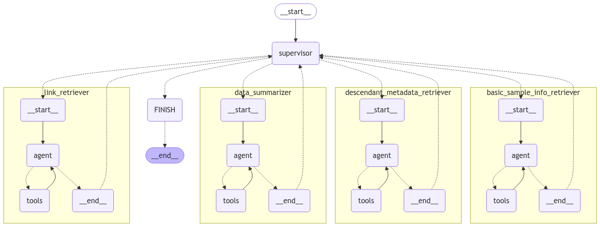

# Semantic LLM-aided Querying (SLAQChat)

This is a chatbot that uses an RDF-based semantic layer to transform user questions into database queries.

This is an extension feature of NExtSEEK, a platform for active data management. For more information, please visit the [NExtSEEK website](https://nextseek.mit.edu/).

You can find the source code for NExtSEEK [here](https://github.com/BMCBCC/NExtSEEK). 

## Current Agent Architecture

This chatbot is built using LangGraph, a framework for building multi-agent systems. Currently, the chatbot is designed to answer questions about the samples housed in the NExtSEEK database.

It is comprised of 5 main agents working in tandem to answer user questions:

1) **Supervisor Agent**: This agent is responsible for deciding which agent to route the user's question to.
2) **Basic Sample Info Retriever Agent**: This agent is responsible for retrieving basic information about any sample from the NExtSEEK database.
3) **Descendant Metadata Retriever Agent**: This agent is responsible for retrieving metadata about the descendants of a given sample. Given the hierarchical nature of how data is modeled in NExtSEEK, this is a crucial step in answering questions about the lifecycle of a specific sample throughout the course of the experiment.
4) **Data Summarizer Agent**: This agent is responsible for summarizing the data retrieved by the other agents.
5) **Link Retriever Agent**: This agent is responsible for retrieving the links to the data and protocols associated with a given sample.

This chatbot is designed to be modular and extensible to support increasingly more complex queries and more sophisticated agents.

This architecture is represented graphically in the following figure:



## Project Structure

- root directory

```
.
├── ENV.yml
├── ProjectDescription.docx
├── README.md
├── backend
├── db_data
├── docker-compose.yml
├── init-db
├── multiagents_architecture.png
├── multiagents_sys.png
├── multiagents_system2.png
├── src
├── state_db
```

- src directory
```
src
└── chatbot
    ├── __init__.py
    ├── app.py
    ├── assets
    ├── baml_client
    │   ├── __init__.py
    │   ├── async_client.py
    │   ├── globals.py
    │   ├── inlinedbaml.py
    │   ├── partial_types.py
    │   ├── sync_client.py
    │   ├── tracing.py
    │   ├── type_builder.py
    │   └── types.py
    ├── baml_src
    │   ├── clients.baml
    │   ├── generators.baml
    │   └── resume.baml
    ├── basic_chat.ipynb
    ├── bot.py
    ├── query_tools_chat.ipynb
    └── studio
        ├── agent.py
        ├── langgraph.json
        ├── prompts.py
        ├── requirements.txt
        └── sample_retriever.py
```

- backend directory
```
backend
├── Tools
│   ├── core
│   │   ├── __init__.py
│   │   └── database.py
│   ├── schemas.py
│   ├── services
│   │   ├── __init__.py
│   │   ├── helpers.py
│   │   ├── llm_service.py
│   │   └── sample_service.py
│   └── test_tools.py
├── __init__.py
└── database
    ├── __init__.py
    ├── __pycache__
    │   ├── models.cpython-312.pyc
    │   └── populate_db.cpython-312.pyc
    ├── db_config.sh
    ├── getdbSchema.sh
    ├── impact_statistics.ipynb
    ├── mockdb_test.ipynb
    ├── models.py
    ├── old_partial_schema.sql
    └── populate_db.py
```

## Contact

For any questions or feedback, please contact me (Taïsha Joseph) at taishajo@mit.edu.

## Resources

- [LangChain Academy](https://academy.langchain.com/) 
- [Multi-Agent System with LangGraph](https://blog.futuresmart.ai/multi-agent-system-with-langgraph)